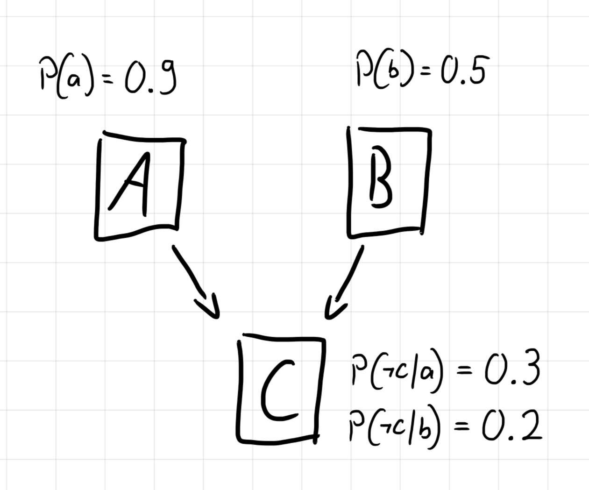

# Haskell implementation of a Bayesian Network

To familiarise myself more with Bayesian Networks (BN) discussed in the 'Reasoning and Agents' course I took at The University of Edinburgh.

## What are these networks?
Bayesian Networks are a compact way to represent joint probabilities.

> [This article](https://towardsdatascience.com/introduction-to-bayesian-networks-81031eeed94e) is a nice introduction to BNs.

As a further addition, I reduced the probability distributions for each RV from a table like this:

| A | B |  c   | $\neg$c |
| - | - | ---- | ------- |
| T | T | 0.94 | 0.06    |
| T | F | 0.7  | 0.3     |
| F | T | 0.8  | 0.2     |
| F | F | 0    | 1       |

to a set of so-called "inhibitors" from which the entire table can be deduced:
$P(\neg c|a) = 0.3$ and $P(\neg c|b) = 0.2$. This reduces a table of size $2^{n+1}$ to only $n$ inhibitors.

## Building a network

There are two types of boolean RVs available:
```haskell
data BoolRV =
    PrimBoolRV
        String  -- name
        Float   -- P(X=true)
    | BoolRV
        String      -- name
        [BoolRV]    -- parents
        Inhibitors  -- inhibitors ()

type Inhibitors = Map RV Float
```

### Example:



translates into:

```haskell
a, b, c :: BoolRV

a = PrimBoolRV "A" 0.9
b = PrimBoolRV "B" 0.5

c = BoolRV "C" [a, b] (Map.fromList [
        (a, 0.3), -- P(¬c|a) = 0.3
        (b, 0.2)  -- P(¬c|b) = 0.2
    ])
```

**👆 This example is supplied in `tests.hs`.** To open it, just run `ghci tests.hs` in the terminal.

## Calculating probabilities

The `State` type is used to describe the "state" of a variable (positive, negated, or arbitrary)
```haskell
data State =
    IS RV       -- e.g. P(a)
    | NOT RV    -- e.g. P(¬a)
    | ARB RV    -- e.g. P(A)
```

The function `p :: [State] -> [State] -> Float` is used as an equivalent of $P(Xs|Ys)$.

- $P(a, \neg b, C)$ translates to
```haskell
p [IS a, NOT b, ARB c] []  -- 0.45
```

- $P(a|b, \neg c)$ translates to
```haskell
p [IS a] [IS b, NOT c]  -- 0.7297
```

### Arbitrary RVs

Any RV not named is assumed to be arbitrary:
$$
    P(a, \neg b)
    = P(a, \neg b, C)
    = P(a, \neg b, c) + P(a, \neg b, \neg c)
$$

## Complexity
For $n$ Random Variables:

**Space complexity:**
- $\Omega(n)$ if every new RV is only dependent on a single other
- $O(2^n)$ if every new RV is connected dependent on all others

**Time complexity** for calculating...
- $P(x)$: $\Theta(m)$ for $m$ parents
  - $\Omega(1)$ if $X$ is a primitive variable (has no parents)
  - $O(n)$ if $X$ has $n$ parents
- $P(x|y)$: $\Theta(2^m)$ for $m$ parents not shared by $X$ and $Y$
  - $\Omega(1)$ if $Y$ is the only parent of $X$
  - $O(2^n)$ if $X$ and $Y$ together have $n$ parents, as in that case $P(x|y) = \alpha P(x,y,Zs)$
